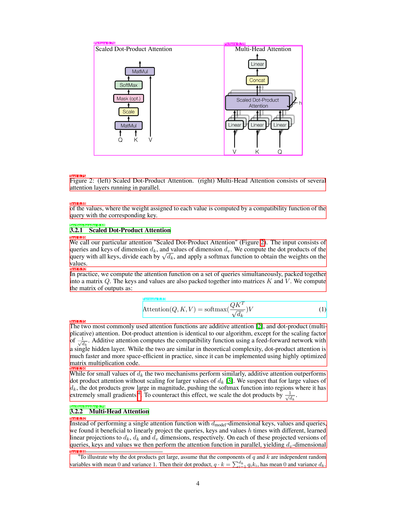
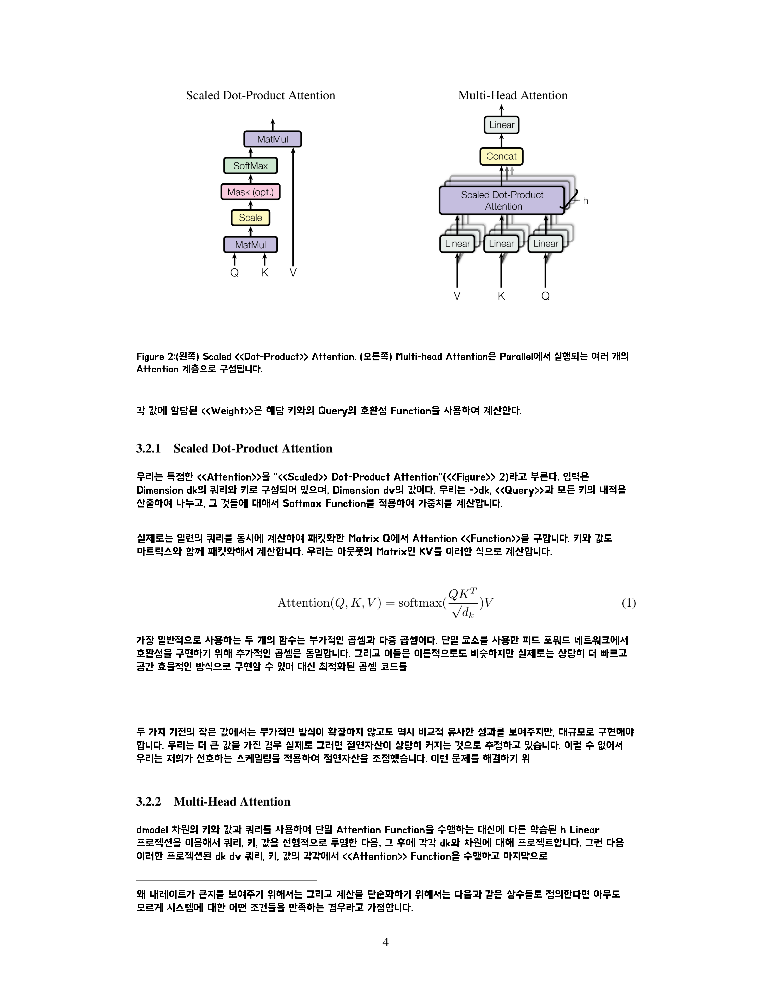
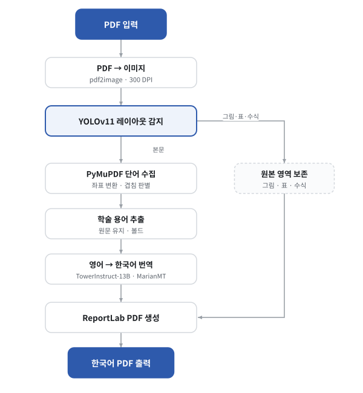
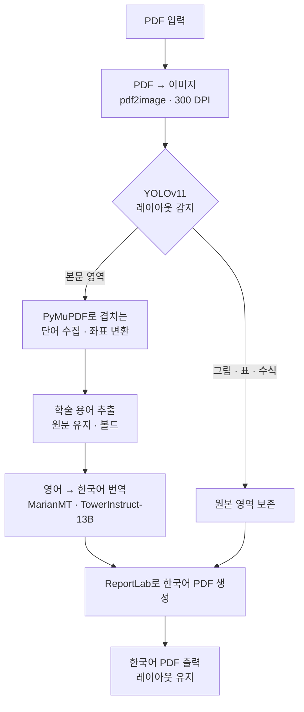
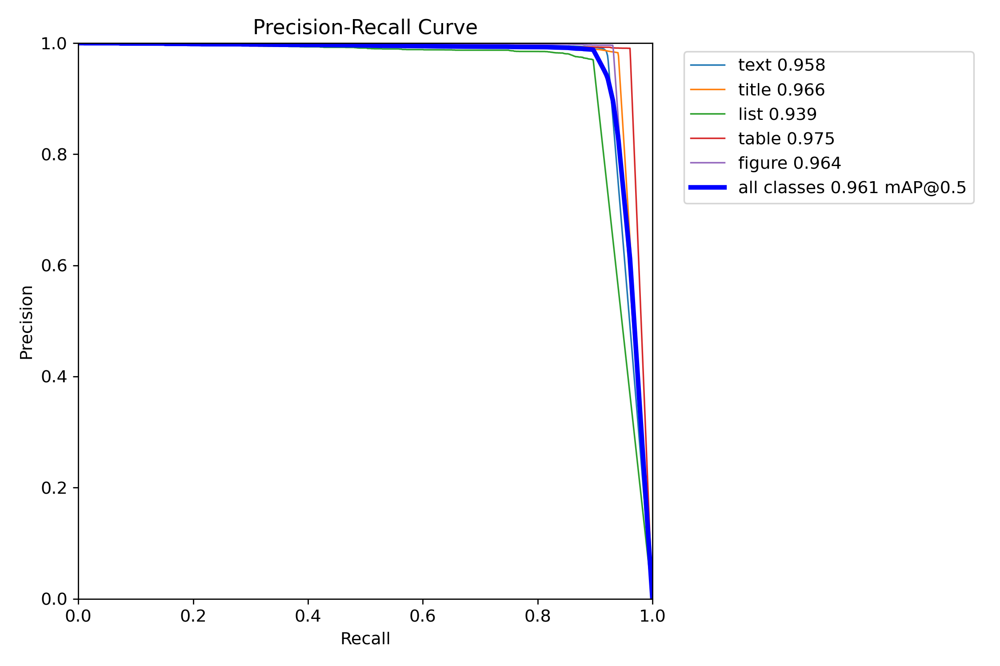

# 논문 번역기 (PDF Paper Translator)

영문 학술 논문 PDF를 레이아웃은 그대로 두고 본문만 한국어로 바꾸는 파이프라인이다. 그림·표·수식은 원본을 그대로 얹고, 본문 텍스트 영역만 골라 번역해 덮는다.

- **레이아웃 검출** — YOLOv11로 본문/그림/표/수식 영역을 잡아 번역할 곳과 보존할 곳을 가른다 (DocLayNet 모델)
- **본문 추출 + 용어 보호** — PyMuPDF로 본문 단어를 뽑고, 약어·그리스 문자·모델명 같은 학술 용어는 번역에서 빼 원문 그대로 둔다
- **번역** — TowerInstruct-13B를 직접 QLoRA 파인튜닝, 기본값은 MarianMT
- **재배치** — 픽셀↔포인트 좌표 변환으로 번역문을 원래 위치에 다시 그린다

> 세종대 인공지능학과 _파이썬기반딥러닝_ 수업으로 만든 프로젝트(2025). 추론 파이프라인은 [`modules/`](modules/), 모델 학습·평가 코드는 [`training/`](training/)에 있다.

## 번역 예시

|                         YOLO 객체 감지 (Before)                         |                     번역 결과 (After)                      |
| :---------------------------------------------------------------------: | :--------------------------------------------------------: |
|  |  |

왼쪽은 YOLOv11이 그림·표·수식·제목·본문을 박스로 잡은 결과, 오른쪽은 그 영역을 기준으로 본문만 한국어로 바꾼 결과다. 배경 이미지를 뺀 버전([`assets/after_nobg.png`](assets/after_nobg.png))도 같이 나온다.

## 아키텍처



<details>
<summary>다이어그램 소스 (Mermaid · 편집용)</summary>



본문은 번역해서 덮고, 그림·표·수식은 원본을 그대로 두는 두 갈래가 마지막 PDF 생성 단계에서 합쳐진다.

> 그림 안에 박힌 글자까지 읽고 싶으면 EasyOCR 모듈([`modules/ocr_processor.py`](modules/ocr_processor.py))을 붙여 `term_extractor.extract_from_ocr_results()`로 넘기면 된다. 기본 흐름은 PyMuPDF 텍스트만 쓰고 OCR은 꺼둔 상태다(`config.py`의 `ocr_enabled=False`). 왜 뺐는지는 아래 [통합하면서 겪은 것](#통합하면서-겪은-것)에 적어뒀다.

## 모듈 (`modules/`)

| 모듈                        | 하는 일                                                       |
| --------------------------- | ------------------------------------------------------------- |
| `pdf_converter.py`          | PDF를 고해상도 이미지로 변환 (pdf2image)                      |
| `text_extractor.py`         | PyMuPDF로 텍스트·바운딩박스 추출 (span/block/word 단위)       |
| `yolo_detector.py`          | YOLOv11 레이아웃 감지 (+ `MockYOLODetector`)                  |
| `image_extractor.py`        | 보존할 그림/표/수식 영역을 이미지로 잘라냄 (Pillow)           |
| `ocr_processor.py`          | _(선택)_ EasyOCR로 이미지 속 글자 인식 (+ `MockOCRProcessor`) |
| `term_extractor.py`         | 약어·그리스 문자·모델명을 골라 번역에서 보호                  |
| `translator.py`             | 영어→한국어 번역 (TowerInstruct-13B `causal` / MarianMT)      |
| `coordinate_transformer.py` | YOLO(pixel) ↔ PyMuPDF(point) 좌표 변환                        |
| `pdf_generator.py`          | ReportLab로 한국어 PDF 생성 (배경 유지/제거 두 종류)          |

## 모델 학습과 성능 (`training/`)

레이아웃 검출과 번역, 두 모델을 직접 학습시켰다. 코드와 평가는 [`training/`](training/)에, 자세한 설명은 [`training/README.md`](training/README.md)에 있다.

**YOLOv11 레이아웃 검출** — `yolov11l-doclaynet`을 PubLayNet에 DocLayNet 수식 클래스를 더해 파인튜닝했다. PubLayNet 검증 결과는 아래와 같다.

| mAP@0.5    | mAP@0.5:0.95 | Precision | Recall |
| ---------- | ------------ | --------- | ------ |
| **0.9606** | 0.9324       | 0.9830    | 0.9304 |



다만 이 파인튜닝 모델은 정작 파이프라인엔 쓰지 못했다. 수식 클래스를 병합하는 과정에서 나머지 클래스 라벨이 날아간 채 학습돼, 실제 페이지에선 수식만 잡았다. 그래서 파이프라인은 `yolov11l-doclaynet` 사전학습 모델(11클래스)을 그대로 쓴다 — `config.py`의 `CLASS_NAMES`가 DocLayNet 기준인 것도 이 때문이다.

**TowerInstruct-13B 번역** — `Unbabel/TowerInstruct-13B-v0.1`을 AI-Hub 한영 병렬 말뭉치 4종(en→ko, 약 5백만+ 문장 쌍)으로 QLoRA(4-bit) 파인튜닝했다.

| #   | 데이터셋 (AI-Hub)                         | 구축 | 규모         | 도메인                              |
| --- | ----------------------------------------- | ---- | ------------ | ----------------------------------- |
| 1   | 국제 학술대회용 전문분야 한영/영한 통번역 | 2023 | 약 100만+ 쌍 | 의학·IT·전기전자·기계·화학·물리수학 |
| 2   | 기술과학 분야 한-영 번역 병렬 말뭉치      | 2021 | 약 150만 쌍  | 특허·기술매뉴얼·연구보고서·IT       |
| 3   | 한국어-영어 번역 말뭉치(기술과학)         | 2020 | 약 160만 쌍  | 과학기술 문헌·뉴스·정부문서         |
| 4   | 한국어-영어 번역 말뭉치(사회과학)         | 2020 | 약 160만 쌍  | 경제·사회·정치·문화·교육·법률       |

평가는 _Attention Is All You Need_ 본문 24문장으로 했다(정답은 Papago로 옮긴 뒤 직접 검수).

| BLEU      | BERTScore P | BERTScore R | BERTScore F1 |
| --------- | ----------- | ----------- | ------------ |
| **59.62** | 0.8935      | 0.8867      | **0.8900**   |

7B 모델 LoRA 파인튜닝(`train_7b_lora.py`)도 따로 돌려봤다.

## 통합하면서 겪은 것

모델은 따로 보면 잘 나왔는데(mAP 0.96, BLEU 59.6), 막상 합치니 논문 한 편 번역에 2시간 40분이 걸리고 번역이 거의 안 나왔다. 원인은 셋이었다.

- **YOLO가 수식만 잡음** — 위에 적은 라벨 버그. 사전학습 DocLayNet 모델로 되돌렸다.
- **원문이 안 가려짐** — YOLO 박스와 텍스트 좌표 스케일이 안 맞아, 영문 위에 한글이 어긋난 채 겹쳤다. 좌표 변환을 다시 맞췄다.
- **OCR이 영문을 깨뜨림** — 크롭 이미지 OCR 결과가 너무 망가져서 OCR을 빼고 PyMuPDF 텍스트만 쓰도록 바꿨다. 폰트 크기와 줄바꿈 처리도 같이 손봤다.

## 설치 & 실행

```

</details>bash
pip install -r requirements.txt          # 추론 파이프라인 (학습 환경은 training/README.md)
```

가중치·폰트·번역 모델은 용량 때문에 저장소에 넣지 않았다. 직접 받아서 아래 위치에 두면 된다.

- YOLO 가중치 — `models/yolov11l-doclaynet.pt`
- 한글 폰트 — `fonts/BMHANNAPro.ttf`(본문), `fonts/MaruBuri-Bold.ttf`(볼드)
- 번역 모델 — 파인튜닝한 13B 병합 모델 디렉토리 (안 두면 MarianMT로 동작)

경로는 환경변수로 덮어쓸 수 있다.

| 환경변수                                     | 기본값                         | 설명                                      |
| -------------------------------------------- | ------------------------------ | ----------------------------------------- |
| `PAPER_TRANS_MODEL_DIR`                      | `Helsinki-NLP/opus-mt-en-ko`   | 번역 모델 (로컬 13B 경로면 `causal` 자동) |
| `PAPER_TRANS_YOLO_PATH`                      | `models/yolov11l-doclaynet.pt` | YOLO 가중치                               |
| `PAPER_TRANS_INPUT_PDF`                      | `PDF_before/test1.pdf`         | 입력 PDF                                  |
| `PAPER_TRANS_OUTPUT_DIR`                     | `PDF_after/`                   | 출력 디렉토리                             |
| `PAPER_TRANS_FONT` / `PAPER_TRANS_BOLD_FONT` | `fonts/…`                      | 한글 폰트                                 |

```bash
python main.py                                   # 기본 (MarianMT)
PAPER_TRANS_MODEL_DIR=/path/to/13B python main.py   # 파인튜닝 13B로 번역
```

클래스 매핑, IoU 임계값, 폰트 크기, 배경 옵션 같은 세부 설정은 [`config.py`](config.py)의 `DEFAULT_CONFIG`에 모여 있다.

## 학술 용어 보호

`term_extractor`는 제목·섹션 헤더와 그림/표/수식 영역에서 번역하면 안 되는 용어를 골라 원문으로 두고, 제목 용어는 볼드 처리한다.

```
입력:  BERT achieves 0.95 F1-score ... ResNet50 vs VGG16 ... α = 0.01
보호:  BERT(약어) · F1-score(하이픈) · ResNet50/VGG16(모델명) · α(그리스 문자)
번역:  the, is, have, model, method … (일반 영단어는 그대로 번역)
```

고른 용어는 `{원본파일명}_terms.tsv`(용어·출처·페이지·빈도·유지여부·이유)로 떨어진다.

## 거쳐온 버전

1. Helsinki-NLP MarianMT 단일 스크립트 프로토타입
2. EasyOCR로 이미지 속 글자를 읽어 용어집을 만들던 버전 (평탄 구조)
3. `modules/`로 쪼개고, OCR 대신 규칙 기반 용어 추출로 바꾼 지금 버전
4. YOLO·Tower 학습 코드를 [`training/`](training/)으로 합침

## 한계

- 다단·복잡 레이아웃은 영역 분리가 흔들릴 수 있다
- LaTeX 수식은 번역하지 않고 원문 그대로 둔다
- 한글 폰트·YOLO 가중치·번역 모델은 직접 준비해야 한다 (저장소 미포함)
- 100페이지 넘는 PDF는 메모리를 많이 먹는다

## 스택

`Python` · `PyTorch` · `transformers` · `ultralytics(YOLOv11)` · `EasyOCR` · `PyMuPDF` · `pdf2image` · `Pillow` · `ReportLab` · `peft` · `bitsandbytes`

## 만든 사람 · 참고

MIT License · **유건** — 세종대 인공지능학과 · [github.com/yg2127](https://github.com/yg2127) · [yg2127.github.io](https://yg2127.github.io)

- YOLOv11 [ultralytics](https://github.com/ultralytics/ultralytics) · DocLayNet 사전학습 [hantian/yolo-doclaynet](https://huggingface.co/hantian/yolo-doclaynet) · 번역 [Unbabel/TowerInstruct-13B-v0.1](https://huggingface.co/Unbabel/TowerInstruct-13B-v0.1)
- [PyMuPDF](https://pymupdf.readthedocs.io/) · [EasyOCR](https://github.com/JaidedAI/EasyOCR) · [ReportLab](https://www.reportlab.com/)
